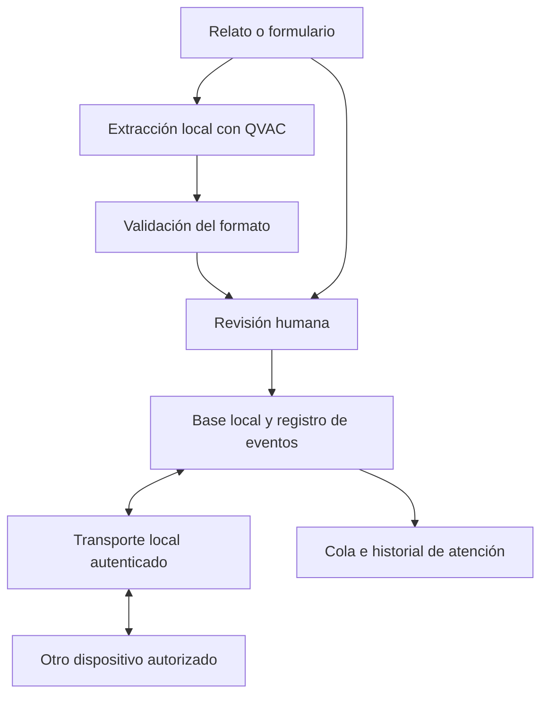

# Perseus.ai

**IA local para registrar y coordinar necesidades ante desastres naturales en Panamá.**

Perseus.ai propone convertir relatos de emergencia en reportes estructurados con IA ejecutada en el dispositivo mediante **QVAC**. Una persona revisa la información antes de confirmarla; los reportes se conservan localmente y se comparten con otros equipos cuando existe un enlace disponible.

El primer país de implementación es **Panamá**, con escenarios de inundaciones, deslizamientos, sismos, lluvias intensas e incendios forestales. La expansión internacional se evaluará después de validar el funcionamiento local.

**Estado al 9 de septiembre de 2026 (Ventana de Construcción):**
El pipeline de inferencia local con QVAC (100% on-device) y la aplicación completa están implementados.

> [!NOTE]
> **Arquitectura de la Aplicación:**
> La app cuenta con 5 tabs principales (Inicio, Reportar, Historial, P2P, Perfil), onboarding con recolección de datos de rescate, revisión humana post-IA, y panel diferenciado por rol (Ciudadano vs Rescatista). El almacenamiento es 100% local con SQLite. Los datos personales solo se transmiten al enviar un reporte via P2P.


## Información para el jurado

| Elemento | Información |
| --- | --- |
| Evento | Decentralized AI Hackathon — ISD Summit 2026 |
| Ventana de construcción | 9 de septiembre, 08:00, al 11 de septiembre, 08:00; hora de Panamá, UTC-5 |
| País inicial e idioma | Panamá; español |
| Tecnología de inferencia prevista | QVAC, en el dispositivo |
| Video de demostración | **PENDIENTE:** agregar enlace sin credenciales; español y máximo cinco minutos |
| Versión entregada | **PENDIENTE:** agregar etiqueta y hash del commit final |
| Equipo | **PENDIENTE:** agregar nombres, perfiles de GitHub y contribuciones |
| Desafío corporativo | **PENDIENTE:** indicar desafío elegido y evidencia, o participación solo en el ranking general |

## El problema

Durante una emergencia, los equipos necesitan registrar qué ocurrió, dónde, cuántas personas solicitan apoyo y qué información falta. Los relatos pueden llegar incompletos y las interrupciones de conectividad dificultan compartirlos y mantener su estado.

En Panamá, [SINAPROC documenta amenazas hidrometeorológicas y geofísicas](https://www.sinaproc.gob.pa/wp-content/uploads/2022/12/Gird-PLAN.pdf). Perseus.ai se enfoca en una tarea concreta: ayudar a brigadistas y voluntarios a registrar necesidades con claridad, incluso cuando no pueden consultar un servicio remoto de IA.

El proyecto busca complementar los procedimientos de respuesta existentes. **No existe una alianza, integración ni respaldo institucional confirmado de SINAPROC u otra entidad.**

## Cómo funcionará

1. **Registrar:** escribir el relato o completar un formulario, incluyendo referencias de ubicación disponibles.
2. **Organizar:** QVAC propone un resumen y campos estructurados en el propio dispositivo.
3. **Revisar:** una persona corrige y confirma la ficha. Los datos desconocidos permanecen como desconocidos.
4. **Guardar:** conservar el reporte localmente, aunque no exista conexión.
5. **Compartir:** intercambiarlo con un equipo autorizado mediante un enlace local y confirmar su recepción.
6. **Coordinar:** consultar el historial, proponer atención y revisar conflictos al reconectarse.

### Ejemplo de uso

En un **escenario sintético de inundación en Chiriquí**, una brigadista selecciona la provincia y registra:

> Somos cuatro personas junto a la escuela del barrio. Nos falta agua. No sé el nombre de la calle.

La ficha propuesta conserva cuatro personas, necesidad de agua y la referencia a la escuela. Chiriquí procede de la selección de la operadora. La calle, el corregimiento y las coordenadas permanecen desconocidos si no se aportaron. La persona revisa la ficha antes de compartirla.

## Alcance y estado de implementación

Los elementos siguientes son objetivos del MVP. Actualizar su estado únicamente después de comprobarlos en la versión entregada.

| Capacidad | Estado actual |
| --- | --- |
| Captura por texto y formulario | ✅ Implementada (texto, audio, foto) |
| Extracción y resumen local con QVAC | ✅ Implementados (Whisper + VisionPsy + Llama 3.2 1B) |
| Validación de salida y revisión humana | ✅ Implementadas (pantalla de revisión editable) |
| Almacenamiento local persistente | ✅ Implementado (SQLite con expo-sqlite) |
| Transferencia entre dos dispositivos físicos por LAN sin internet | 🔧 UI implementada, transporte TCP pendiente |
| Acuses, reintentos y deduplicación de eventos | 🔧 Lógica de deduplicación por UUID implementada, transport pendiente |
| Cola de reportes e historial de atención | ✅ Implementados (historial + cola rescatista) |
| Detección de asignaciones en conflicto | Planificada |
| Transcripción local de voz | ✅ Implementada (Whisper Base Q8_0 via QVAC) |

El MVP no contempla diagnóstico, triaje clínico autónomo, predicción de desastres, rutas garantizadas como seguras, despacho automático ni pagos reales. Visión y una red de radio con múltiples saltos quedan fuera del recorrido principal.

## Arquitectura propuesta



La ruta directa del formulario a revisión permite continuar si el modelo no está disponible.

| Componente | Elección | Responsabilidad |
| --- | --- | --- |
| Interfaz | React Native 0.81.5 + Expo SDK 54 + Expo Router 6 | 5 tabs, onboarding, revisión humana, detalle |
| Inferencia | QVAC `@qvac/sdk` 0.18.2 | Whisper ASR + VisionPsy Nano + Llama 3.2 1B on-device |
| Modelo | Whisper Base Q8_0, VisionPsy Nano 460M Q8_0, Llama 3.2 1B Q4_0 | Transcripción, análisis visual, extracción estructurada |
| Persistencia | expo-sqlite 15.0.0 | Perfil, reportes y eventos de sync locales |
| Sincronización | TCP Sockets (UI lista, transport pendiente) | Envío unidireccional ciudadano → rescatista |

El reporte contempla provincia o comarca, distrito, corregimiento, referencia textual y ubicación opcional. Se conserva el origen de los datos y se permite guardar sin una dirección formal.

Cada cambio tendrá un identificador de evento para evitar duplicados al reenviarlo. Dos asignaciones concurrentes se conservarán como conflicto para resolución humana; no se promete exclusividad entre equipos desconectados.

### Qué significa funcionar sin internet

| Situación | Comportamiento previsto |
| --- | --- |
| Sin internet y sin enlace entre equipos | Capturar, procesar y guardar localmente; compartir queda pendiente |
| Sin internet, con Wi-Fi local activo | Capturar y compartir entre dispositivos autorizados |
| Con internet durante la preparación | Descargar dependencias y modelos para su posterior ejecución local |

La demo prevista utiliza una LAN sin salida a internet. Su punto de acceso sigue siendo necesario para ese intercambio. No se presenta como una red mesh de radio independiente de toda infraestructura.

### Uso de QVAC

Las bases permiten inferencia local o delegada entre pares y prohíben enrutarla a una API en la nube. Perseus.ai elige ejecutar el modelo en cada dispositivo compatible. **En el MVP, P2P comparte reportes; no delega la inferencia.**

La integración deberá mantener todas las rutas de inferencia dentro de QVAC y sin fallback a una API remota. Si el modelo falla, el recorrido alternativo será el formulario. La ausencia de llamadas de inferencia a la nube deberá comprobarse y documentarse antes de la entrega.

## Instalación y ejecución

### Ejecución del Banco de Pruebas de IA (Testbench)

Para probar la inferencia y el pipeline de IA local (Voz, Visión, LLM) en la pantalla de prueba:

```bash
# 1. Instalar dependencias
npm install

# 2. Ejecutar pruebas unitarias de IA
npm run test:ai

# 3. Iniciar en Navegador Web (Simulador interactivo)
npx expo start --web

# 4. Iniciar en Dispositivo Físico Android (App nativa)
npm start
```


Recorrido que deberán cubrir las instrucciones finales:

1. Obtener el commit de entrega e instalar sus dependencias.
2. Preparar los modelos y comprobar su integridad y disponibilidad local.
3. Compilar e instalar en el dispositivo declarado.
4. Cerrar la aplicación, cortar internet y volver a abrirla.
5. Crear y recuperar un reporte sin internet.
6. Conectar el segundo equipo a la LAN sin WAN y comprobar la transferencia.

Consultar la [documentación de QVAC](https://docs.qvac.tether.io/) y su [guía de integración con Expo](https://docs.qvac.tether.io/tutorials/expo/) durante la implementación. Estas guías no sustituyen las instrucciones específicas de Perseus.ai.

## Demostración y pruebas

El video mostrará el funcionamiento real de la versión entregada, con datos sintéticos. Recorrido previsto: creación y revisión de una ficha, transferencia al segundo equipo, actualización durante una desconexión y sincronización al reconectar.

### Plan de evaluación

| Prueba | Objetivo interno | Resultado actual |
| --- | --- | --- |
| Extracción | Evaluar 30 relatos en español; reservar 10 para evaluación final | No ejecutada |
| Calidad de campos | Al menos 90 % de coincidencia en campos explícitos; registrar invenciones y errores | No medida |
| Latencia local | Medir 20 ejecuciones, carga inicial separada, mediana, p95 y máximo; objetivo exploratorio menor a 15 s | No medida |
| Transferencia | 20 eventos en LAN sin WAN; objetivo menor a 5 s por evento en condiciones declaradas | No medida |
| Reenvíos | 10 reenvíos sin duplicación lógica | No ejecutada |
| Persistencia | 5 reinicios sin pérdida de reportes confirmados | No ejecutada |
| Reconexión | 5 ciclos con recuperación de eventos pendientes | No ejecutada |
| Concurrencia | Preservar y resolver una asignación en conflicto | No ejecutada |

Los objetivos no son resultados ni garantías de seguridad. Publicar hardware, modelo, tamaños de entrada y fallos junto con las mediciones. La evaluación utiliza lugares de Panamá y comprueba que nombres incompletos no producen ubicaciones inventadas.

**Evidencia pendiente:** video, resultados, topología de red y registro de tráfico que permita comprobar la ausencia de inferencia remota. Para probar almacenamiento local se pueden apagar todas las radios; para probar transferencia debe mantenerse activo el enlace local.

## Seguridad, privacidad y límites

- La IA propone información; las decisiones de atención corresponden a personas autorizadas.
- Una recepción confirmada no significa que el rescate esté en camino.
- La extracción debe conservar negaciones y dudas, y rechazar salidas inválidas.
- El hackathon utilizará relatos sintéticos; no se requieren nombres completos, documentos ni wallets de afectados.
- El intercambio deberá utilizar un canal autenticado y cifrado. Su implementación y el almacenamiento de claves deben verificarse antes de afirmar que están protegidos.
- Las fotos y el audio, si se incorporan, permanecerán locales por defecto.
- La aplicación no está validada para emergencias reales ni sustituye los canales oficiales.

## Referencias de diseño

| Referencia | Aplicación propuesta |
| --- | --- |
| [IFRC — Evaluación de necesidades](https://www.ifrc.org/document/ifrc-emergency-needs-assessment-and-planning-guidance) | Distinguir contexto, observaciones, necesidades y revisión |
| [Manual Esfera](https://spherestandards.org/handbook/) | Orientar categorías de agua y saneamiento, alimentación, alojamiento y salud |
| [ISO 22320](https://www.iso.org/standard/67851.html) | Orientar roles, responsabilidades y coordinación; referencia a su alcance público |
| [SINAPROC — Centro de Operaciones de Emergencia](https://www.sinaproc.gob.pa/centro-de-operaciones-de-emergencia/) | Contexto de coordinación institucional en Panamá |

El esquema es una adaptación propia. Citar estas referencias no implica certificación, conformidad integral, aval institucional ni permiso para incorporar sus textos completos al modelo.

## Declaración de trabajo previo y componentes de terceros

Esta sección responde al artículo 11 de los Términos y Condiciones del hackathon: **toda base preexistente utilizada debe declararse en el README con su origen**. El inventario debe actualizarse con los componentes realmente incluidos en el commit final.

### Material preparatorio utilizado hasta el 8 de septiembre

| Base | Origen | Uso en Perseus.ai |
| --- | --- | --- |
| Idea y boceto inicial | Equipo Perseus.ai; archivo `PerseusAI_Documentacion_Proyecto.md.pdf` | Punto de partida del concepto |
| Documentación de producto | Equipo Perseus.ai con asistencia de IA; versión 1.3 preparada el 6 de septiembre de 2026, archivo `PerseusAI_Documentacion.md` | Alcance, arquitectura propuesta, escenarios y planificación |
| Este README | Preparado con asistencia de IA el 8 de septiembre de 2026 a partir de la documentación del equipo | Presentación y estructura de declaración para el repositorio |
| Referencias humanitarias y técnicas | Fuentes enlazadas en las secciones anteriores | Investigación y decisiones de diseño; no son componentes implementados |

La preparación documentada aquí precede a la ventana de construcción. La aplicación sustancial se desarrollará entre el 9 de septiembre a las 08:00 y el 11 a las 08:00, hora de Panamá. Al finalizar, agregar una relación de contribuciones realizadas durante ese periodo y sus commits; no presentar este material preparatorio como creado durante las 48 horas.

### Dependencias previstas que requieren declaración final

Las filas siguientes son un inventario de planificación, **no una afirmación de que las dependencias ya estén integradas**.

| Componente | Origen conocido o pendiente | Versión, licencia y uso final |
| --- | --- | --- |
| QVAC | [Documentación oficial](https://docs.qvac.tether.io/) | PENDIENTE: paquete y versión usados, origen del artefacto, licencia y módulo de inferencia |
| React Native | [Proyecto oficial](https://reactnative.dev/) | PENDIENTE: versión y licencia del componente utilizado |
| Expo | [Proyecto oficial](https://expo.dev/) | PENDIENTE: versión, licencia y plantilla utilizada, si aplica |
| SQLite y adaptador | [SQLite](https://www.sqlite.org/); adaptador por seleccionar | PENDIENTE: biblioteca de integración, origen, versión y condiciones |
| Modelo de lenguaje y pesos | Por seleccionar | PENDIENTE: autor, URL exacta, versión, licencia y cuantización |
| Biblioteca de transporte | Por seleccionar | PENDIENTE: nombre, URL exacta, versión, licencia y modificaciones |
| Otros activos o componentes | Agregar los utilizados; indicar ninguno solo tras revisar | PENDIENTE: plantillas, iconos, fuentes, conjuntos de datos y código reutilizado |

Se ha utilizado asistencia de IA para la investigación, organización y redacción de la documentación. Si se utiliza también para programar, registrar las herramientas y el alcance de ese uso en la versión final. Su uso no reemplaza la revisión del código ni la atribución de componentes ajenos.

## Desarrollo durante el hackathon

**Pendiente de completar con trabajo realizado.** Registrar funcionalidades implementadas, responsables y commits de la ventana oficial. Actualizar las tablas de estado, instalación y resultados para que correspondan al mismo commit que aparece en el video.

Antes del cierre, comprobar:

- [ ] QVAC ejecuta la inferencia de la versión entregada sin API de nube ni fallback remoto.
- [ ] La declaración de bases preexistentes incluye todo lo utilizado y su origen.
- [ ] Las instrucciones permiten reproducir el recorrido y describen las limitaciones reales.
- [ ] Los resultados publicados provienen de pruebas ejecutadas.
- [ ] El video está en español, dura como máximo cinco minutos y se abre sin credenciales.
- [ ] El jurado puede acceder al repositorio durante toda la evaluación.
- [ ] Se completaron equipo, commit, video y, si aplica, desafío corporativo.
- [ ] Ambos entregables se enviaron antes del 11 de septiembre de 2026 a las 08:00, hora de Panamá.

## Próximas etapas

1. Completar y evaluar el MVP durante el hackathon.
2. Revisar el flujo con una organización participante mediante un simulacro en Panamá.
3. Ampliar pruebas a otras provincias y comarcas según recursos y colaboradores disponibles.
4. Evaluar voz local, transporte diferido y mejoras de accesibilidad.
5. Estudiar la expansión a otros países después de validar utilidad y soporte en Panamá.

## Propiedad intelectual y licencia

Según las bases facilitadas, la propiedad intelectual de la solución permanece en el equipo y no se exige una licencia abierta para participar. La licencia del código propio **está pendiente de decisión del equipo**; los componentes de terceros conservan sus condiciones respectivas.

La entrega del video concede a ISD y Tether los derechos de difusión establecidos en el artículo 19 de las bases. Ese permiso sobre el video es distinto de la titularidad del código.
