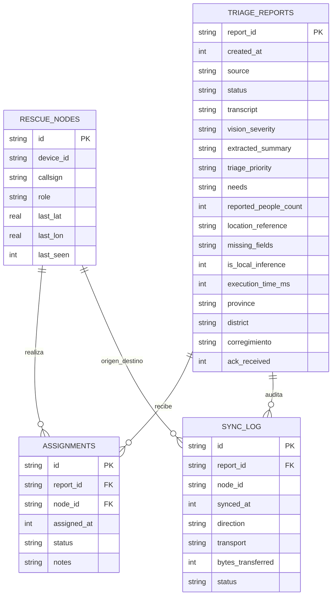

# Arquitectura del Sistema — Perseus.ai

Red P2P de triaje emergencial offline-first con Inteligencia Artificial on-device, desarrollada para el **Decentralized AI Hackathon (ISD Summit, 9–11 de septiembre de 2026, Ciudad de Panamá)**.

---

## 1. Principio Fundamental: Cómputo Secuencial y Descentralización

```
┌────────────────────────────────┐       Mesh P2P Local      ┌────────────────────────────────┐
│  Dispositivo A (Expo / RN)     │◄── (WiFi LAN / BLE) ───►│  Dispositivo B (Expo / RN)     │
│                                │                         │                                │
│  1. UI de Rol (Afectado)       │                         │  1. Cola de Prioridad (Rescate)│
│  2. QVAC SDK (Whisper + LLM)   │                         │  2. QVAC SDK (Mismo runtime)   │
│  3. SQLite Local (4 entidades) │                         │  3. SQLite Local (4 entidades) │
└────────────────────────────────┘                         └────────────────────────────────┘
```

- **Sin Servidor Central:** Cada dispositivo opera con autonomía total. No existe backend de aplicación ni base de datos centralizada.
- **Inferencia 100% On-Device:** La transcripción de audio (Whisper), el análisis visual y la extracción semántica (Llama 3.2 1B) corren localmente usando **QVAC SDK** con aceleración por hardware (NEON / arm64).
- **Secuenciación Estricta:** El dispositivo nunca ejecuta inferencia neuronal y difusión por red simultáneamente para prevenir contención de CPU/batería en hardware móvil.

---

## 2. Modelo de Datos Local (SQLite — 4 Entidades Principales)

Cada dispositivo móvil posee una copia idéntica del esquema SQLite:



---

## 3. Protocolo de Sincronización y Transporte P2P

1. **Descubrimiento y Emparejamiento:** Comunicación directa entre pares mediante socket local sin salida a internet (LAN aislada / WiFi Direct / BLE).
2. **Estructura de Paquetes (`P2PPacket`):** Formato JSON plano con cabeceras de versión, emisor, tipo (`REPORT_SYNC`, `ACK_REPORT`, `ASSIGNMENT_CLAIM`, `NODE_BEACON`), payload y timestamp.
3. **Deduplicación Estricta:** Uso de `report_id` y `assignment_id` únicos. El reenvío de paquetes conocidos se descarta silenciosamente o confirma sin duplicar registros.
4. **Manejo de Conflictos:** Si dos brigadas reclaman el mismo caso de forma concurrente mientras estaban desconectadas, el sistema marca el estado en `conflicto`, preserva ambas propuestas y permite al coordinador resolver la asignación definitiva.
5. **Auditoría para el Jurado (`sync_log`):** Cada transmisión registra dirección, bytes y transporte como prueba visual demostrable de transferencia offline.
